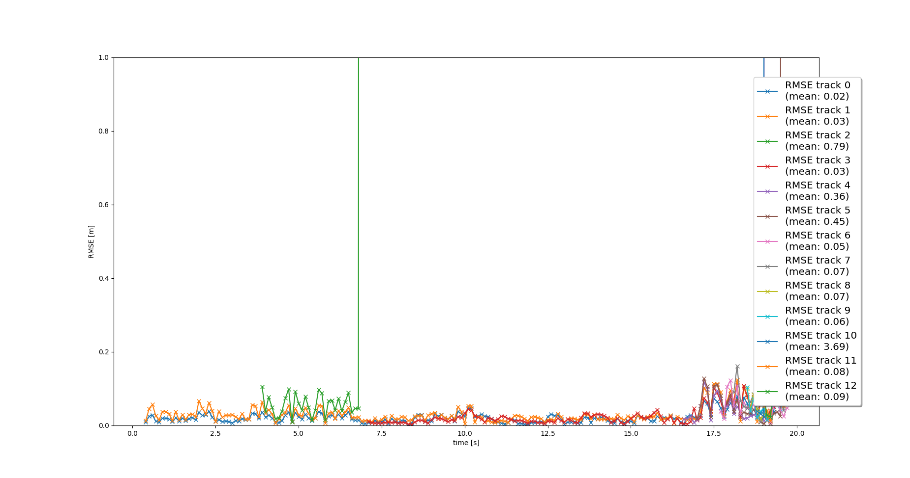

# Project: Sensor Fusion: Track 3D-Objects Over Time
## How to run the project:
1) Make sure to include all the files and dependencies which were required in the previous project for 3D Object Detection. Check this link:
2) All the implementation files are in student folder.
3) To run each specific part of the project, setup the datafile name, frames as well as include 'show_tracks' in exec_visualization and 'perform_tracking' in exec_tracking
4) Check tracking_output.mp4 for final video.

### 1. Write a short recap of the four tracking steps and what you implemented there (filter, track management, association, camera fusion). Which results did you achieve? Which part of the project was most difficult for you to complete, and why?

1) The first thing to implement was implementation of the Kalman Filter Class in filter.py file. Keeping the Kalman Filter Equations in mind, its implementation was quite straight forward. The only thing to keep in mind was to use appropiate track and meas methods for the calculations. Part 1 results:

2) Implementing track management was all down to step-by-step progress. First, we use unassigned measurement to create initialize track utilizing the rotation matrix for co-ordinate transform. The track score is implemented as mentioned. The main challenge here was to come-up with parameters in param.py as well as deciding when to delete tracks, when to confirm or when to switch track status from initialized to tentative etc. This required very trial and error techniques. All the track scores are capped at 1.0. As a robust solution we also initialize another parameter know as num_frames. This is initialized to one as soon as a track is created. We increment this in associate_and_update() function to check what is the age of the track. When the track num_frames exceed a certain amount (8) we check if the track's score is still low we delete that track. This is done to remove the clutter tracks which have low confidence. Other criteria for deleting tracks are if the confirmed track's score fall below the delete_threshold (0.70). Lastly we also delete tentative tracks if their score fall below 0.45 as we want the tentative scores to either turn into confirm tracks or get deleted, again following the policy of clean and confident tracks only. The results for Part 2:

3) Data Association: Implementing Association also entailed similar steps to the trackmanagement implementation. The very first step was to implement gating and MHD distance methods. The association matrix were implemented in a similar fashion as it was taught in the module, with finding the minimum value in the association matrix and remove its corresponding row and column . Then we remove the track and measurement from the corresponding unassigned lists. During this implementation, I noticed that my tracking algorithm was tracking vehicles apart from the 2-3 vehicles which are moving in front of the car. Turns out these are not ghost detections but actual cars/vehicles which were parked at the side of the road. Initially this caused the tracks (the main two) to diverge or get deleted. This called for more paramter tuning to ensure smooth and correct tracking. Here are the results for part 3:

You can see that when the uncertainty increases of the track the RMSE rises and the track is eventually deleted.

4) Camera Fusion: This was one of the most trickiest aspect of this project. Initially fusing camera data with lidar completely ruined the tracking management. The problem arises in the loop_over_dataset function where we call both lidar and camera measurements sequentially. Camera sensor is usually less accurate than the lidar because it has no depth measurement. This coupled with the fact that it has more sensitive jacobians. With careful selected parameters these were the results of part 4:

### 2. Do you see any benefits in camera-lidar fusion compared to lidar-only tracking (in theory and in your concrete results)?

In my case fusing both camera-lidar did little to no improvement in tracking as compared to lidar only. In theory there should be advantages, but that depends how you process both the lidar and camera data. In our case, lidar-only tracking performed better, suggesting the fusion pipeline (especially camera projection) needs refinement before it can outperform lidar-only tracking. There could be multiple reasons why this happens? Noisy and not well-aligned with 3D object centers, Missing depth information (z) etc

### 3. Which challenges will a sensor fusion system face in real-life scenarios? Did you see any of these challenges in the project?

Sudden movcement of an object with a sensor fusion system that relies on a static parameters will cause the tracking to be inaccurate. Also in real life, sudden objects can come up, which if not intialized and confirmed quickly could be devastating. Slight miscalibrations lead to incorrect data fusion. Even 1–2° error can shift projections significantly in 3D space. One sensor might “see” an object while another doesn’t, leading to inconsistent updates or missing associations.

### 4. Can you think of ways to improve your tracking results in the future?

In this project we are simply taking sequential data from both lidar and then camera. Actually we are updating back-to-back with both the sensors. There are potential solutions to solve this issue. We can use the camera updates sparingly. We can also change the association and update strategy to fuse the measurements into one list along with a priority list or  update each track once and not twice per frame.

Implementing an advanced data association like GNN or JPDA will make sensor fusion more stable. Using non-linear motion model will also make the sensor fusion module more robust. This will greatly improve our tracking results.
